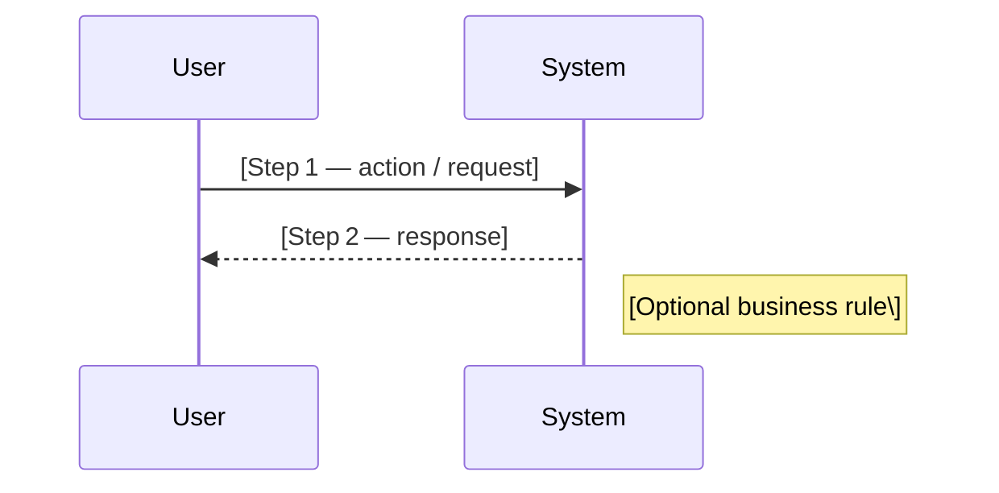

### Flow Diagram Template v1.0

Use this template to document system or user flows in a way that is both **human‑readable** and **machine‑convertible** into diagrams (e.g., Mermaid, PlantUML).  
Replace bracketed placeholders `[]` with concrete values.

---

#### Title  
`[Flow Name]`

#### Objective  
Briefly describe the purpose of the flow in **one short sentence**.

---

#### Primary Success Flow  

> **Tip:** Mermaid `sequenceDiagram` is the default.  
> - Use `flowchart TD` for non‑sequential process flows.  
> - Keep step labels short; elaborate in *Descriptions* if needed.

---

#### Alternate & Exception Flows  

| Flow ID | Trigger / Condition | Steps | Outcome |
|---------|--------------------|-------|---------|
| ALT‑1 | `[Condition that diverts from primary]` | `[Bullet list of steps]` | `[Result]` |
| ERR‑1 | `[Error or failure scenario]` | `[Bullet list of steps]` | `[User/system feedback]` |

---

#### Descriptions & Business Rules  

| Step ID | Detailed Description | Business Rule / Constraint |
|---------|----------------------|----------------------------|
| 1 | `[Deeper explanation of Step 1]` | `[e.g., must validate input]` |
| 2 | `[Deeper explanation of Step 2]` | `[e.g., must log transaction]` |

---

#### Needs Clarification  
Use this section when information is missing or ambiguous.

- `[Question about payment gateway?]`
- `[What should happen if user is unauthenticated?]`

---

#### Documented Assumptions  

- `[Assume user has an active session]`
- `[Assume API latency < 500 ms]`

---

#### Potential Conflicts or Contradictions  

- `[If another flow handles refunds, remove refund logic here]`

---

#### Revision History  

| Version | Date | Author | Change Notes |
|---------|------|--------|--------------|
| 1.0 | `[YYYY‑MM‑DD]` | `[Name]` | Initial template |

---

> **QA Alignment:**  
> - Each **Acceptance Criterion** in related user stories should trace to a **Step** or **Business Rule** above.  
> - Ensure error flows include expected HTTP codes or UI feedback messages where relevant.