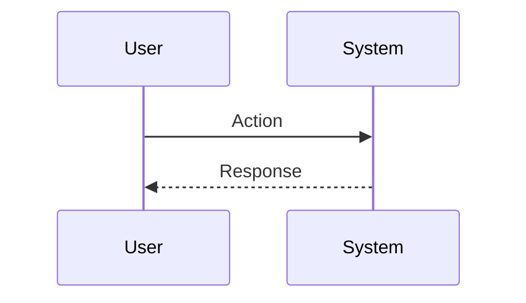

h1. Functional Requirements Document (FRD) – v1.0

*Document Status:* {status:Draft}  

|| Priority || {status:HIGH} ||
|| Size || [Small \| Medium \| Large] ||
|| Approval Date || [YYYY-MM-DD] ||
|| Owner || [Your Name] ||
|| Change Log || [e.g., MG: Initial draft Apr 30 2025] ||

---

h2. 1. Overview  

h3. 1.1 Purpose  
Describe the objective of the feature or component in **one sentence**.

h3. 1.2 Background / Context  
Brief context explaining *why* this work is needed (business driver, user pain, etc.).

h3. 1.3 Scope  
*In Scope* – bullet list of what is included.  
*Out of Scope* – bullet list of what is not included.

---

h2. 2. Goals & KPIs  

|| *Business Goals* ||  
| • Goal 1 – {text} |  
| • Goal 2 – {text} |

|| *Key Performance Indicators (KPIs)* ||  
| • KPI 1 – {text} |  
| • KPI 2 – {text} |

---

h2. 3. Functional Requirements  

h3. 3.1 Feature Summary  
Describe core feature capabilities in plain language.

h3. 3.2 Requirement Details  
|| *ID* || *Requirement* || *Priority* || *Notes / Business Rule* ||  
| FR‑1 | {text} | High | — |  
| FR‑2 | {text} | Medium | [Link to rule] |  

h3. 3.3 Non‑Functional Requirements  
|| *NFR ID* || *Requirement* || *Metric / Target* ||  
| NFR‑1 | Performance | Response < 500 ms |  
| NFR‑2 | Accessibility | WCAG 2.2 AA compliance |

---

h2. 4. Content & Data Structure  

h3. 4.1 Data Model / Fields  
|| *Field* || *Type* || *Required* || *Description* ||  
| Title | Text | Yes | Main heading |  
| Image | Media | Optional | 3:2 ratio |  
| ... |  |  |  |

h3. 4.2 Sample JSON / Payload  
```json
{
  "title": "Sample",
  "image": "/sample.jpg"
}
```

---

h2. 5. User Flow / Interaction  

_Embed a Mermaid diagram or link to the flow template._



Alternate & error flows should be documented in the flow template.

---

h2. 6. Acceptance Criteria & Definition of Done  

h3. 6.1 Acceptance Criteria  
# Given ... When ... Then ...  
# …

h3. 6.2 Definition of Done  
* Code reviewed & merged  
* Automated tests pass  
* Documentation updated  

---

h2. 7. Assumptions & Dependencies  

*Assumptions* – list any assumed truths.  
*Dependencies* – upstream/downstream systems, teams, or third‑party integrations.

---

h2. 8. Analytics & Tracking  

Specify required tracking events (dataLayer, GA, etc.) and success metrics instrumentation.

---

h2. 9. Accessibility & Compliance  

Outline accessibility requirements (WCAG level), security, privacy or compliance constraints.

---

h2. 10. Future Enhancements (Out of Scope)  

Bullet list of potential future features not addressed in this release.
